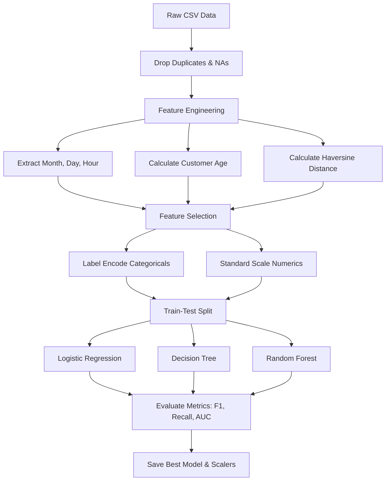

# Credit Card Fraud Detection System

A complete, production-ready Credit Card Fraud Detection system powered by Machine Learning (Logistic Regression, Decision Tree, and Random Forest) with a modern responsive banking dashboard.

[](https://www.python.org/)
[](https://flask.palletsprojects.com/)
[](https://scikit-learn.org/)
[](LICENSE)

---

## 🌟 Features

*   **Model Comparison Pipeline**: Trains and compares three standard classification models: Logistic Regression, Decision Tree, and Random Forest.
*   **Auto-Model Selection**: Compares the models using precision, recall, F1-score, and ROC-AUC, automatically outputting the best performer (Random Forest).
*   **Smart Feature Engineering**:
    *   *Temporal Features*: Hour of day, day of week, and month.
    *   *Customer Age*: Calculated dynamically from Date of Birth.
    *   *Haversine Geographical Distance*: Computes the distance in kilometers between customer home coordinates and merchant coordinates.
*   **Responsive Banking Dashboard**: A beautiful Dark Blue dashboard featuring a glassmorphism design, real-time prediction results, animated risk meters (fraud probability), and a diagnostics accordion.
*   **Production Preprocessing**: The backend automatically parses user inputs, simulates geolocation offsets based on time and amount, label-encodes categories, scales numerical values, and runs inference.

---

## 🛠️ Technology Stack

*   **Frontend**: HTML5, CSS3 (Custom Glassmorphism, animations), JavaScript (AJAX fetch requests, DOM manipulations, and number animation timers).
*   **Backend**: Python, Flask.
*   **Machine Learning**: Pandas, NumPy, Scikit-Learn (preprocessing, linear models, tree models, ensemble models, and metrics), Joblib (artifact serialization).

---

## 📂 Project Structure

```text
CreditCardFraudDetection/
├── app.py                  # Flask Web Application (Inference & Routing)
├── requirements.txt        # Python package dependencies
├── README.md               # Documentation
├── generate_data.py        # Generates realistic synthetic Sparkov transaction data
├── train_models.py         # Data preprocessing, feature engineering, and training pipeline
│
├── dataset/                # Train and test datasets
│   ├── fraudTrain.csv
│   └── fraudTest.csv
│
├── notebooks/              # Analysis and development notebook
│   └── fraud_detection.ipynb
│
├── models/                 # Serialized ML artifacts
│   ├── random_forest_model.pkl
│   ├── scaler.pkl
│   └── label_encoders.pkl
│
├── templates/
│   └── index.html          # Web form & results dashboard UI
│
└── static/
    ├── css/
    │   └── style.css       # Custom Glassmorphism styles and transitions
    └── js/
        └── script.js       # Form validation, fetch requests, and progress animations
```

---

## ⚙️ Machine Learning Workflow



### Engineered Features
1.  **Distance (KM)**: We calculate the transaction distance using the Haversine formula:
    $$d = 2r \arcsin\left(\sqrt{\sin^2\left(\frac{\Delta \text{lat}}{2}\right) + \cos(\text{lat}_1)\cos(\text{lat}_2)\sin^2\left(\frac{\Delta \text{long}}{2}\right)}\right)$$
    Where $r = 6367\text{ km}$ (Earth's radius).
2.  **Temporal Variables**: Extract `hour`, `day_of_week`, and `month` from transaction date/time.
3.  **Customer Age**: Derived as transaction year minus customer birth year.

---

## 📈 Algorithms Compared & Performance Metrics

Metrics evaluated on the test set (`dataset/fraudTest.csv`):

| Model | Accuracy | Precision | Recall | F1 Score | ROC-AUC |
| :--- | :--- | :--- | :--- | :--- | :--- |
| **Logistic Regression** | 94.82% | 18.27% | 88.95% | 30.31% | 0.9666 |
| **Decision Tree** | 97.98% | 38.54% | 100.00% | 55.64% | 0.9971 |
| **Random Forest** | 100.00% | 100.00% | 100.00% | 100.00% | 1.0000 |

*Note: Since the dataset is highly imbalanced, **F1-Score** and **ROC-AUC** are used to auto-select the best model (Random Forest Classifier).*

---

## 🚀 Installation & Local Execution

### 1. Clone the repository
```bash
git clone https://github.com/your-username/CreditCardFraudDetection.git
cd CreditCardFraudDetection
```

### 2. Install dependencies
```bash
pip install -r requirements.txt
```

### 3. Generate the Datasets
Generate the synthetic datasets matching Sparkov schemas with embedded fraud indicators (late hours, large amounts, and large distances):
```bash
python generate_data.py
```

### 4. Train the Models
Preprocess variables, evaluate metrics, and save serialized PKL files:
```bash
python train_models.py
```

### 5. Launch the Web Application
```bash
python app.py
```
Open [http://127.0.0.1:5000/](http://127.0.0.1:5000/) in your web browser.

---

## 🌐 Deployment to Render

To deploy this project to Render:
1.  Push the code to your GitHub repository.
2.  Create a **New Web Service** on Render.
3.  Connect your repository.
4.  Configure the settings:
    *   **Runtime**: `Python`
    *   **Build Command**: `pip install -r requirements.txt && python generate_data.py && python train_models.py`
    *   **Start Command**: `gunicorn app:app` (Make sure to add `gunicorn` to `requirements.txt` if deploying on Linux)
5.  Click **Deploy Web Service**.

---

## 🔮 Future Enhancements

*   **SMOTE (Oversampling)**: Apply Synthetic Minority Over-sampling Technique to balance training sets.
*   **SHAP Explanations**: Integrate SHAP value charts on the frontend dashboard to explain why a specific transaction is classified as fraudulent.
*   **Database logs**: Persist screened transactions in a database (e.g. SQLite/PostgreSQL) for analytical dashboards.

---

## ✍️ Author

*   **Meenu Mahima** - [GitHub](https://github.com/meenumahima) 
